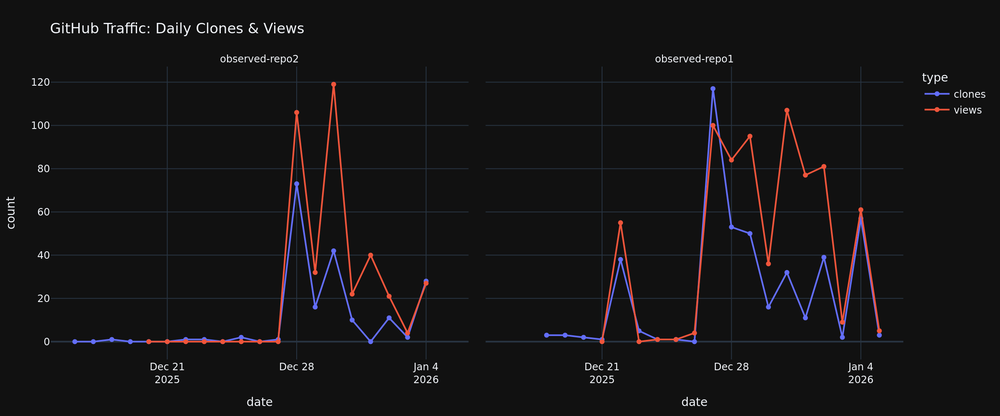

# observatory-dashboard
A automated traffic dashboard for GitHub repositories. Powered by [groda/github-traffic-archiver](https://github.com/marketplace/actions/github-traffic-archiver), it generates daily interactive visual reports of clones and views via Jupyter and Plotly.

### 📊 Latest Traffic Trends
